<!-- Generated by tests/preview.py --update. Do not edit by hand. -->

# Gallery

Every option, with the image it produces.

All are rendered for **August 2026** with the 1st highlighted as "today", so the
variants are directly comparable.

Options are passed to the action as inputs (see the
[README](../README.md#options)) or to the CLI as flags.

## Defaults — nothing enabled

`default-light` / `default-dark` — *(defaults)*

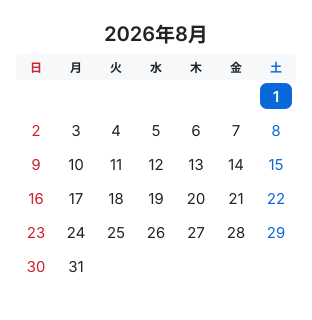 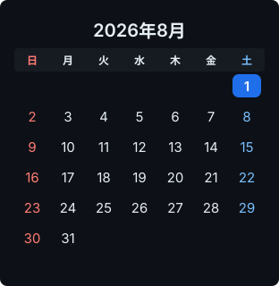

`en-light` / `en-dark` — `locale='en'`

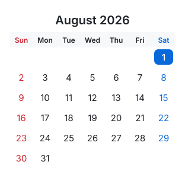 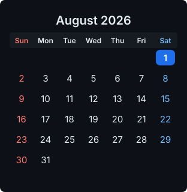

## Palette: mono

`mono-light` / `mono-dark` — `palette='mono'`

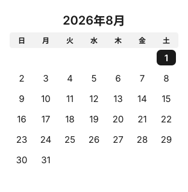 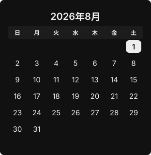

## Palette: washi

`washi-light` / `washi-dark` — `palette='washi'`

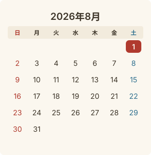 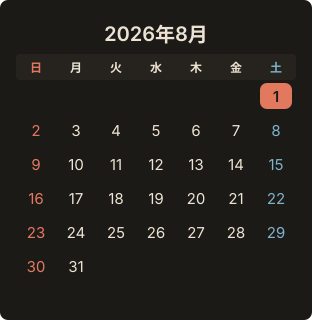

## Locale, week start, timezone label, shape

`en-monday-light` — `locale='en'`, `week_start='monday'`

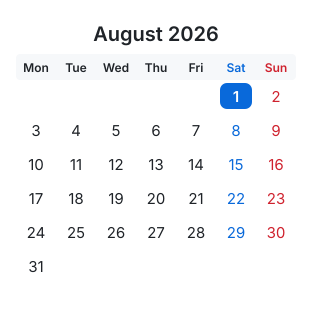

`timezone-label-light` — `show_timezone=True`

`square-light` — `radius=0`

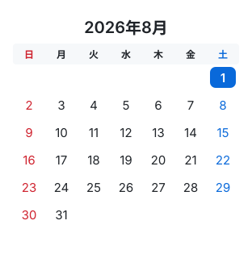

`border-light` / `border-dark` — `border=True`

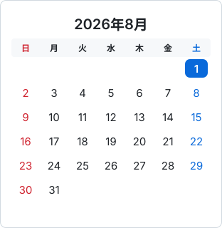 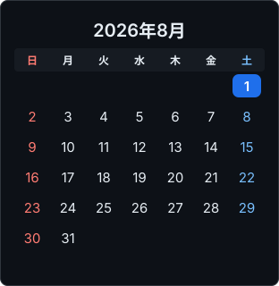

## Embedded font subset

`embedded-font-light` — `font='noto-sans-jp'`

## Rokuyō

`rokuyo-light` / `rokuyo-dark` — `show_rokuyo=True`

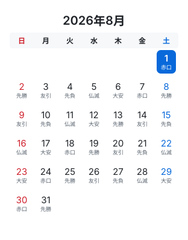 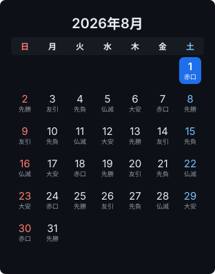

## Solar terms

`solar-terms-light` — `show_solar_terms=True`

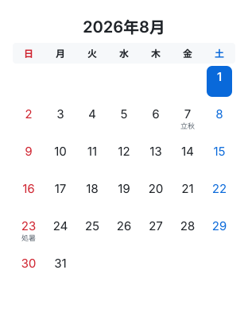

`rokuyo-terms-light` / `rokuyo-terms-dark` — `show_rokuyo=True`, `show_solar_terms=True`

 

`rokuyo-font-light` — `show_rokuyo=True`, `show_solar_terms=True`, `font='noto-sans-jp'`

## Moon phase and moon age

`moon-light` / `moon-dark` — `show_moon=True`

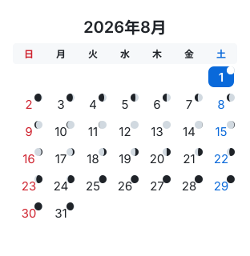 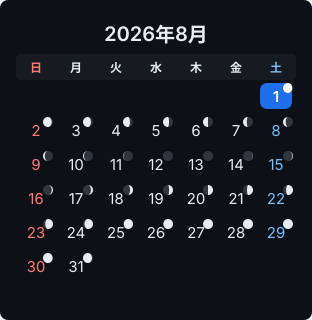

`moon-age-light` — `show_moon=True`, `show_moon_age=True`

## Everything at once

`full-light` / `full-dark` — `show_moon=True`, `show_rokuyo=True`, `show_solar_terms=True`, `border=True`

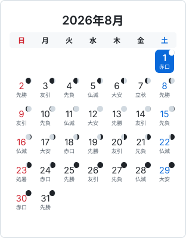 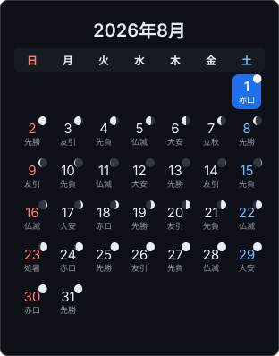

## Public holidays

`holiday-jp-light` / `holiday-jp-dark` — `holiday_country='JP'`, `show_holiday_names=True`

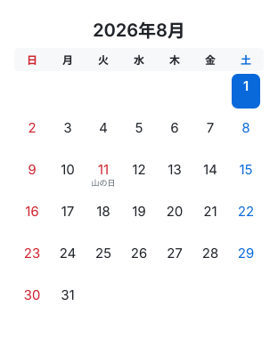 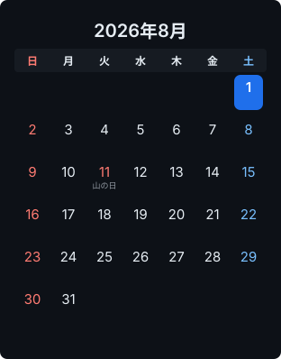

`holiday-us-light` — `holiday_country='US'`, `locale='en'`, `week_start='monday'`

`everything-light` — `holiday_country='JP'`, `show_holiday_names=True`, `show_moon=True`, `show_rokuyo=True`, `show_solar_terms=True`, `border=True`, `font='noto-sans-jp'`

## Stacked annotations

`stack-light` — `show_rokuyo=True`, `show_solar_terms=True`, `annotation_mode='stack'`

`stack-all-light` / `stack-all-dark` — `holiday_country='JP'`, `show_holiday_names=True`, `show_rokuyo=True`, `show_solar_terms=True`, `annotation_mode='stack'`, `border=True`

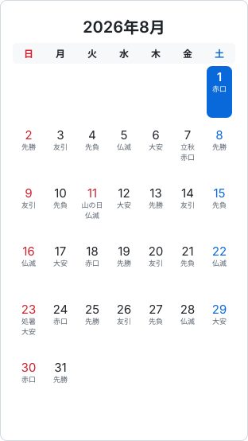 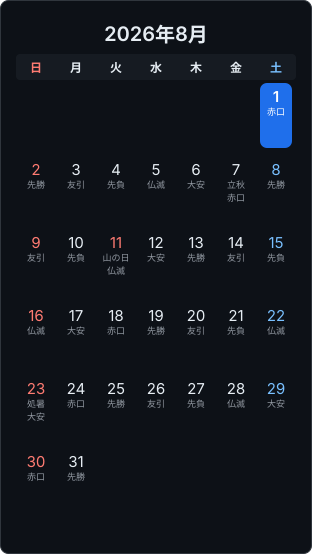

## Annotation colour

`colorized-light` — `show_rokuyo=True`, `show_solar_terms=True`, `annotation_mode='stack'`, `colorize_annotations=True`

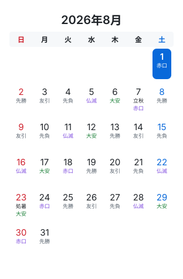

`colorized-washi-light` — `palette='washi'`, `show_rokuyo=True`, `show_solar_terms=True`, `annotation_mode='stack'`, `colorize_annotations=True`

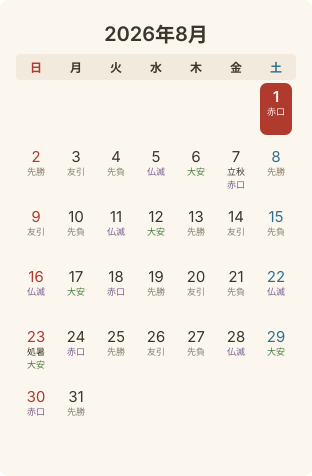

## Moon phase — position and colour

`moon-below-light` — `show_moon=True`, `moon_position='below'`, `show_rokuyo=True`

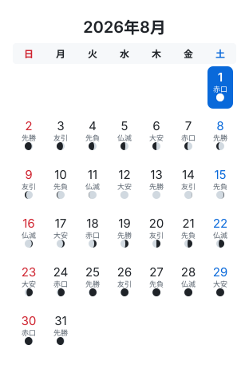

`moon-amber-light` / `moon-amber-dark` — `show_moon=True`, `moon_amber=True`

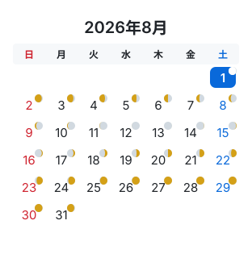 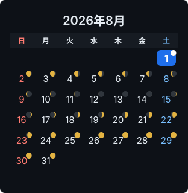

`moon-amber-below-light` / `moon-amber-below-dark` — `show_moon=True`, `moon_amber=True`, `moon_position='below'`, `show_rokuyo=True`

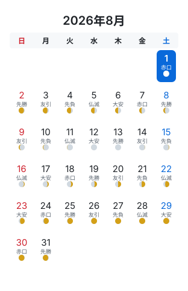 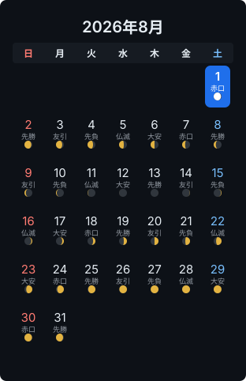

## Almanac selection days

`lucky-light` — `show_lucky_days=True`, `show_rokuyo=True`, `annotation_mode='stack'`, `colorize_annotations=True`

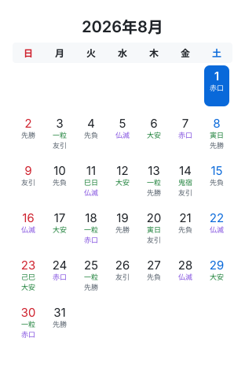

`almanac-light` / `almanac-dark` — `show_lucky_days=True`, `show_unlucky_days=True`, `show_rokuyo=True`, `annotation_mode='stack'`, `colorize_annotations=True`, `border=True`

 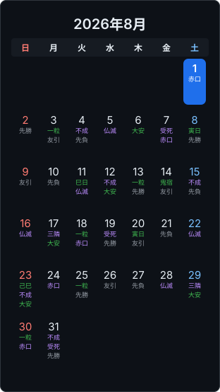

`almanac-table2-light` — `show_lucky_days=True`, `ichiryu_table='II'`, `annotation_mode='stack'`

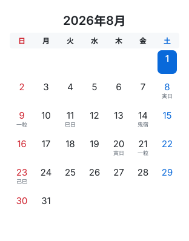

---

Regenerate with `PYTHONPATH=src python3 tests/preview.py --update`.
